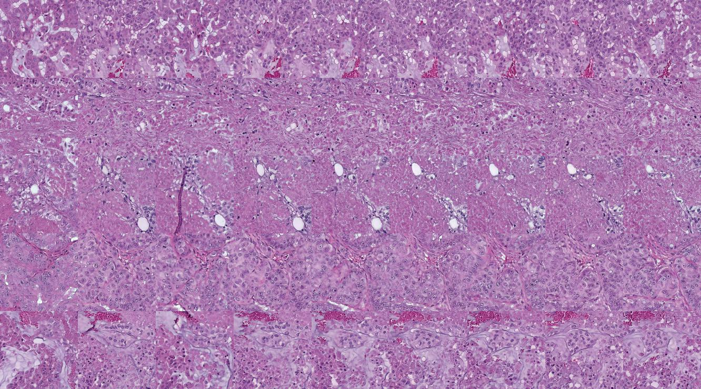
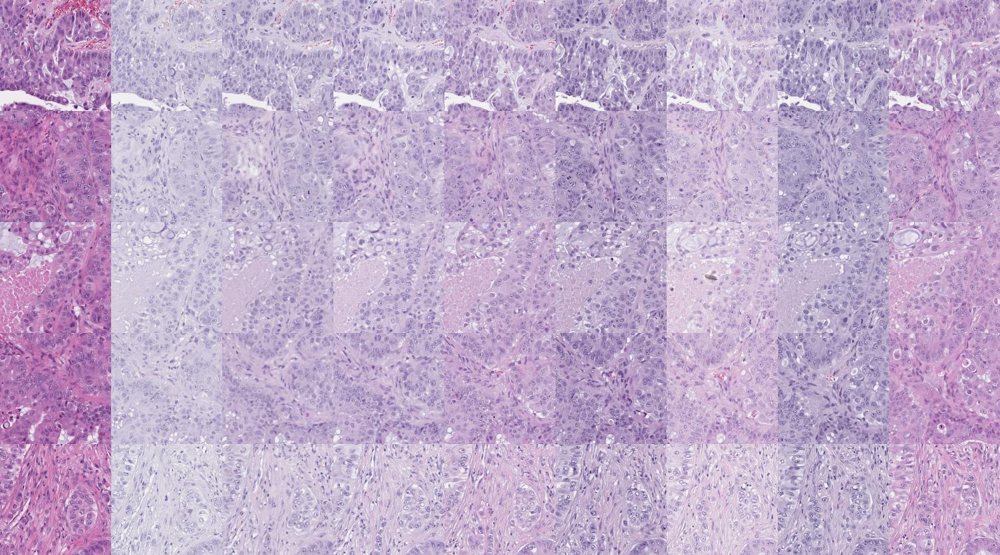
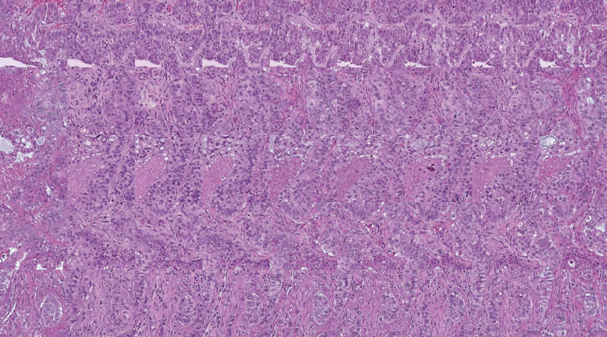
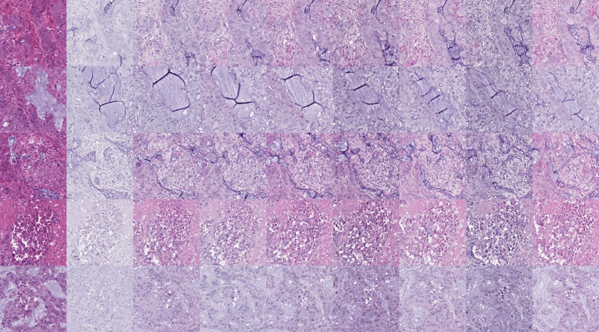
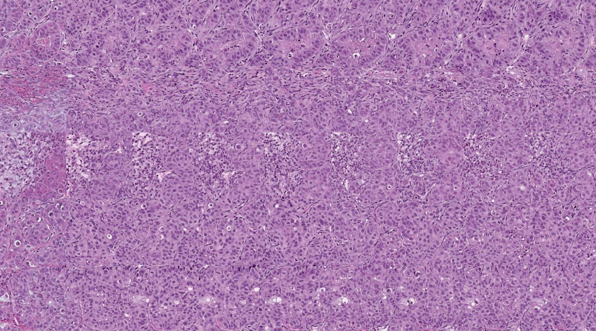
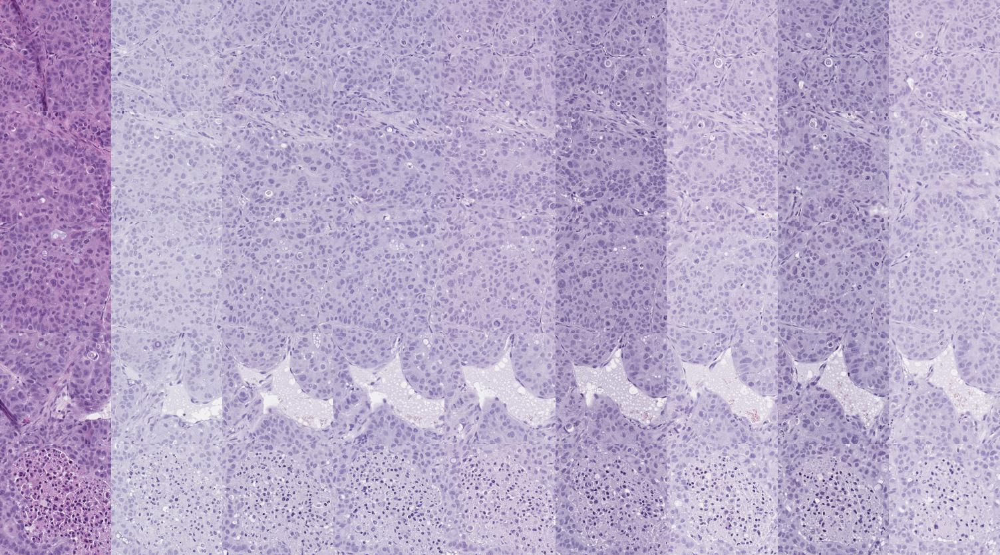

# Normalization of Histological Stains using Deep Convolutional Features

In this repository we will provide the code for the paper *Normalization of Histological Stains using Deep Convolutional Features*.
For more information, visit [the project homepage](https://stes.github.io/fan).

The preprint is available at [https://arxiv.org/abs/1708.04099](https://arxiv.org/abs/1708.04099), the final paper will be accessible via [link.springer.com](https://link.springer.com).

## Installation

If you quickly want to check out the code, we recommend installation via a [virtualenv]()

For the list of dependencies, have a look at the ``requirements.txt`` file and install packages via
```
pip install -f requirements.txt
```

Depending on your preferences, you might install the package either manually or via ``easy_install``.


### Training a model

In order to deploy the model, take the following steps

    - extract your image dataset to the data/ folder
    -

For application of the code, we provide two scrips, ``solver.py`` and ``normalize.py``.
While the former is used to train the model we propose in the paper, the latter is used to apply a trained model.

Using the proposed feature aware normalization network from our paper is simple

``` python
from stainnorm.models import fan

model = FAN()
model.fit(X)
X_normalized = model.transform(X)
```

### Further Notes

Please consider that in this repository, we also published several additional
functions you might consider useful for further research.
Especially, consiser the additional functions in ``layers.py``

We also provide you with a range of additional models and routines for cross-validating
several setups.

## Reference

If you use the Feature Aware Normalization module or other parts of the code
provided here in your own work, please cite the following paper:

```
@incollection{bug2017context,
  title={Context-based Normalization of Histological Stains using Deep Convolutional Features},
  author={Bug, Daniel and Schneider, Steffen and Grote, Anne and Oswald, Eva and Feuerhake, Friedrich and Sch{\"u}ler, Julia and Merhof, Dorit},
  booktitle={Deep Learning in Medical Image Analysis and Multimodal Learning for Clinical Decision Support},
  pages={135--142},
  year={2017},
  publisher={Springer}
}
```

We also have a pre-print available on arxiv: [abs/1708.04099](https://arxiv.org/abs/1708.04099).

## Normalization Examples

Below you find images from the validation set. Each image consists of nine different staining protocols and five different regions from each slide are shown.
In total, the validation set used consists of 5 slides with 5 images extracted from each slide and nine protocol variants available.

Normalization results to the ``HoEoTp`` protocol (first column) are shown.

Before (Block A):

Normalized:


Before (Block B):

Normalized:


Before (Block C):

Normalized:


Before (Block D):

Normalized:


Before (Block E):

Normalized:


For an interactive overview, please visit the [project homepage](https://stes.github.io/fan).
